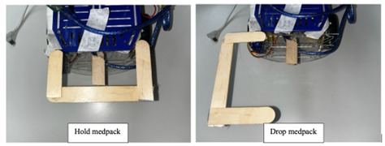

# Alex to the Rescue

### CG2111A Engineering Principle and Practice

#### Semester 2 2024/2025

### Team: B02-3B

## Section 1 Introduction

Recently, an explosion has occurred in Moonbase CEG. Several astronauts were injured during the accident and require immediate rescue. Remote search-and-rescue operations are essential in such situations, where disaster happens in a location that is out of reach or dangerous to enter. Our robot ALEX is designed and constructed to tackle such situations.

Alex needs to be remotely controlled to navigate through an unknown environment containing obstacles and astronauts, and generate a map of the environment. Alex needs to identify astronauts from the other objects, and distinguish between red astronauts, who need to be grabbed and dragged to the safe zone for treatment, and green astronauts, who will be dropped with a medpack instead. After identification, Alex needs to be capable of performing the two respective rescue operations. Moreover, there is an operational time limit of 8 minutes as the astronauts need urgent assistance. Alex should not collide with the obstacles and astronauts to avoid destroying the environment or injuring the astronauts.

## Section 2 Review of State of the Art

### 2.1 PackBot 510 by Teledyne FLIR

PackBot 510 is a tele-operated robot designed for missions such as search and rescue, bomb disposal, surveillance and reconnaissance. It has a rugged chassis with articulated flippers for high mobility across debris and stairs. Its multi-jointed arm is capable of lifting up to 20 kg. It includes high-resolution pan-tilt-zoom cameras with optional thermal or night vision. Its swappable lithium-ion batteries provide over 4 hours of runtime. On the software side, it is controlled by the uPoint® Multi-Robot Control System, a touchscreen-based ruggedized tablet with an Android-based interface, and utilizes the MPU5 radio operating on the Wave Relay MANET for robust wireless communication.

- Strengths: It is modular, easily deployable by a single operator, and capable of operating in confined, debris-filled, and high-risk environments.
- Weaknesses: Its mapping and navigation are heavily operator-driven. It lacks onboard SLAM or AI-based pathfinding unless additional modules are added. Hence, it does not feature full autonomous navigation.

### 2.2 Telemax by Telerob

Telemax is a tele-operated robot engineered for hazardous material handling, EOD (explosive ordnance disposal), CBRN (chemical, biological, radiological, nuclear) response, and search and rescue missions. It features a compact, low-profile design that allows it to operate in tight indoor environments like airplanes, buses, or narrow hallways. Its 6-axis manipulator arm with telescopic extension can handle complex tasks requiring precision, such as cutting wires or operating tools. It includes four individually articulated track arms, giving it the ability to climb stairs and traverse challenging terrain. It is equipped with multiple day and night vision cameras and supports tool attachments like waterjet disruptors and drills. Telemax is controlled via a portable operator control unit with live video feed, joystick-based manipulation, and optional fiber-optic tethering for operation in RF-denied environments.

- Strengths: Offers high-precision manipulation, strong mobility across diverse terrains, and is compact enough for indoor operations. Its modular tool system makes it adaptable to a wide range of EOD and hazmat scenarios.
- Weaknesses: The system is primarily operator-dependent with limited autonomous capability. Advanced autonomy or AI-enhanced features are not standard and require third-party integration.

## Section 3 System Architecture

### 3.1 Concept of Operations

1. Run SLAM to continuously map the environment.
1. Explore blindspots outside the LIDAR’s line of sight that have not been mapped.
1. If a potential astronaut is identified, approach the figure and use the camera to verify if an astronaut is found. If astronaut is found, check the astronaut colour:

   - If astronaut is green, drop Medpack
   - If astronaut is red but Medpack not dropped yet, record its location and come back after Medpack has been dropped
   - If astronaut is red, and Medpack already dropped, grab the astronaut using claw

1. Repeat 1-3 until the environment is fully mapped and red astronaut has been grabbed
1. Drag red astronaut to the safe zone and park there

### 3.2 System Architecture


## Section 4 Hardware Design

### 4.1 Overall layout


The robot components were arranged in three layers to make the robot more compact, reducing the chance of collision. The arduino and breadboard are placed on the bottom layer. The power bank and batteries are placed on the middle layer. The RpiLIDAR is placed on the top layer so that the map generated would not be affected by the other robot components. The RpiCamera is also placed on the top layer so that it is high enough to capture images of the astronauts. The front claw is attached to the bottom layer, as placing the claw lower makes grabbing astronauts more stable. The weight of the robot is distributed evenly on the left and right side to ensure the stability of the robot.

### 4.2 Claw

Examination of the astronauts samples reveal that pushing the astronauts from the back is stable, yet pushing them from the front causes the possibility for them to topple. Hence, in addition to the baseline design outlined in the “It’s the Claw” document, topple prevention designs are added.


We thickened the sides of the claws with cardboard as shown in the figure above. Moreover, we extended the right side of the claw with an ice-cream stick and cardboard, so that it can support the astronaut when it is toppling forward. In addition, we attached foam padding onto the cardboards to further increase the friction and grip of the robot arm.

### 4.3 Medpack holder

Initially, we planned to use the front claw to hold the medpack. However, as the medpack would block the color sensor, we decided to make a back claw specially for the medpack as shown in the photo.

It enables secured delivery of the medpack and does not interfere with the sensors. However, during the trial demo, we realized it makes our robot body too long and increases the possibility of bumping into walls. Hence, we designed a more compact medpack holder as shown in figures below.



It uses one servo motor, which is attached to the upper claw. There is an ice-cream stick placed slightly off-center underneath to support the medpack. When the upper claw is closed, the medpack is secured on the ice cream stick. When the claw opens, the medpack loses balance and gets dropped. The claw then goes back to the closed position to reduce space.

### 4.4 Colour sensor

The colour sensor used is a TCS230/3200 colour sensor. It is a light-to-frequency converter. Further details on its operation and implementation is provided in the software section.

As shown in the left figure, an ambient light shield made of black paper is attached onto the color sensor to reduce the impact of ambient light, making color sensor reading more stable and reliable.


### 4.5 Camera

After testing the RpiCamera, we realized that the outline of objects cannot be detected if the object is too close to the camera or if there is not enough light. Hence, as shown in the right figure, we placed a second color sensor onto the robot to serve as the light source, ensuring there is enough light on the objects to be detected by the camera.

4.6 Circuitry

To avoid the trouble of disconnecting batteries every time after testing, we added in a switch to conveniently disconnect the batteries from the circuit.

## Section 5 Firmware Design

### 5.1 High level algorithm on the Arduino

Arduino acts as the low-level controller of Alex, responsible for executing high-level commands received from the Raspberry Pi – motor (and servo motor) control and color sensing.

#### 5.1.1 Hello Handshake

On startup or restart, RPi will send a hello packet to Arduino to confirm the serial connection

#### 5.1.2 Listen and handle command:

Arduino Continuously listens for incoming packets from the Raspberry Pi via a serial interface. When receiving a valid command (PACKET_TYPE_COMMAND), Arduino deserializes it to get the command and parameters

#### 5.1.3 Command Execution

- Motion Control
  When Arduino receives a movement command with speed and distance or angle, it updates motor speed and direction accordingly. Hall sensors on the wheels then track wheel rotation via interrupts, which is converted to distance travelled. Arduino will continuously compare the targeted distance or angle and stop the motors when the target distance / angle is reached
- Claw and Medpack Holder Control
  Initially the claw is open and the medpack holder is at hold position. When Arduino receives COMMAND_OPEN (green astronaut detected) it sets the respective servo motors angles to open the claw, drop medpack and close medpack holder. When it receives COMMAND_CLOSE (red astronaut detected) it sets the respective servo motors angles to close the claw.
- Getting and clearing statistics
  Arduino continuously updates its color sensor data and internal distance and tick counters through interrupts. However, it only sends them back to RPi when it receives COMMAND_GET_STATS. Upon receiving COMMAND_CLEAR_STATS, it reset all internal counters to 0.
- Send Response Packets:
  After executing a command, the Arduino sends a PACKET_TYPE_RESPONSE back with a RESP_OK or relevant error/status code. The codes are in appendices.

### 5.2 Communication Protocol

The communication system includes:

1. Raspberry Pi and Arduino via Serial USART
1. Remote (Client) and Raspberry Pi (Server) via TLS over TCP

#### 5.2.1 Between RPi and Arduino

We used a C struct TPacket (100 bytes) to transfer data via USART

```C
typedef struct
{
	char packetType;
	char command;
	char dummy[2]; // Padding to make up 4 bytes
	char data[MAX_STR_LEN]; // Optional string data
	uint32_t params[16]; //Up to 16 int parameters
} TPacket;
```

The `packetType` (`TPacketType`), `command` (`TCommandType `) can be found in appendices

#### 5.2.2 Between RPi and Remote Client

##### Remote to RPi

As remote side only needs to send command with at most 2 parameters or hello message (“Hello_RPi”) to RPi, we used a raw byte protocol of size 10 to minimize overhead:
Command (`PacketType` = `NET_COMMAND_PACKET` = 3)

```
[PacketType (1 byte)] [Command (1 byte)] [Param1 (4 bytes)] [Param2 (4 bytes)]
```

or

```
Message (PacketType = NET_DEBUG_PACKET = 4)
[PacketType (1 byte)] [Message (9 byte)]
```

`command` is a small letter and is mapped to TCommandType on RPi, the mapping is in appendices.

##### 5.2.2.2 RPi to Remote

On the other hand, RPi needs to send different types of messages (Lidar reading, Arduino statistics, Error Messages, Hello message) of unknown length to the remote side. Therefore, we used a Json packet to conveniently serialize them:

```ts
{
    "pkg_type": "resp" | "err" | "msg",
    "resp_type": "arduino" | "lidar" | "debug",
    "data": any | null,
    "err": any | null,
}
```

Upon receiving a packet, remote side validates and parses (json.loads) the packet and:

- Error Message: print the error message in red color
- Debug Message: print the debug message
- Arduino packet: print the Arduino statistics
- Lidar packet: publish lidar data to LIDAR_SCAN_TOPIC ("lidar/scan"). SLAM and display nodes will then update the plot automatically.

#### 5.2.3 Complete Message Flow

1. We press a key (WASD, etc.) and the program generates the corresponding command packet
1. Remote sends TLS packet: e.g. `[NET_COMMAND_PACKET, 'f', 50, 90]`
1. RPi (`TLSRelay_recv_node`) receives and parses it, publishes to `ARDUINO_SEND_TOPIC`.
1. Arduino receives `COMMAND_FORWARD` with `params[0]=50, params[1]=90`
1. Arduino executes movement, tracks via hall sensors.
1. Upon completion, Arduino sends `PACKET_TYPE_RESPONSE` with `RESP_OK`.
1. RPi forwards response as JSON to the remote via TLS.

## Section 6 Software Design

### 6.1 High-Level Algorithm on the Raspberry Pi

The Raspberry Pi acts as the middleware controller of Alex, bridging the remote client and the Arduino. It forwards commands to Arduino and forwards response from Arduino back to the remote side.

#### 6.1.1 Command Bridge

RPi Subscribes to both remote and CLI input, validates and converts incoming commands. The detailed routine can be found in 6.4.2, but in the end the verified command will be published to ARDUINO_SEND_TOPIC (“arduino/send”) where alex_arduino_send_node converts the command tuple to TPacket, serializes it and sends it over serial.

#### 6.1.2 Lidar Sensor Preprocessing

alex_lidar_scan_node.py Reads and filters raw distance/angle/quality data from the RPLidar over /dev/ttyUSB0. It directly publishes the raw Lidar scan data to LIDAR_SCAN_TOPIC ("lidar/scan"). SLAM and visualization are by default turned off on RPi, which drastically reduces memory, CPU, GPU and power usage on RPi. In addition, as the raw lidar data is much smaller compared to images, this decision significantly increases communication speed.

#### 6.1.3 Response Bridge

All Arduino responses, Lidar data debug messages, and many error messages are forwarded to the remote side by alex_TLSRelay_send_node.py. It subscribes to ARDUINO_RECV_TOPIC, LIDAR_SCAN_TOPIC, DEBUG_SEND_TOPIC and DEBUG_ERROR_TOPIC, wraps the data or error to a Json packet with the corresponding pkg_type and resp_type and sends it over TLS.

#### 6.1.4 Independent Camera Server

RPi also runs an independent camera http server on port 8000. The remote side can access camera from http://raspberrypi.local:8000/index.html

### 6.2 Teleoperation

The teleoperation system enables remote control over WiFi, with a Raspberry Pi (RPI) acting as a communication bridge between the remote laptop and the onboard Arduino. The Arduino handles low-level hardware control such as driving motors, reading wheel encoder data via hall sensors, and actuating claw servos through GPIO pins.

The Arduino sets up the necessary GPIO pins for motor control and attaches interrupt service routines (ISRs) to the hall sensors to track wheel movement. It maintains separate tick counters for forward, backward, and turning motions, allowing it to estimate both linear displacement and angular rotation accurately. The servos are also controlled by the Arduino through GPIO pins. A control program on the RPI establishes a serial connection with the Arduino and listens for commands from the remote laptop over an encrypted TLS connection through the WiFi network.

A user then runs the corresponding client program and inputs commands specifying instructions. For the movement commands, we used ‘WASD’ and the arrow keys to control the robot’s movement, where ‘WASD’ keys are for smaller movements while the arrow keys are used for larger movements. These keys each corresponded to a specific command. For example, the ‘W’ key corresponded to ‘f 5 80’, which instructs the robot to move forward 5cm at 80% power. For opening and closing of the claws, we used the ‘O’ and ‘E’ keys. These commands are serialised into packets and transmitted over the network to the RPI.

Upon receiving a command, the Arduino interprets it: for movement, it updates direction and drives the motors until the target distance or angle is reached using encoder feedback; for claw commands, it actuates the servos accordingly. Optionally, the Arduino can send telemetry data (e.g., tick counts, distances) back to the RPI, which can relay it to the laptop for feedback or logging.

### 6.3 Color detection

The colour sensor used was a TCS230/3200 colour sensor. Alongside 4 white LEDs to provide light, it also consists of an array of photodiodes. There are 4 types of photodiodes, distinguished by the colour filter they are behind: Red, Green, Blue, and Clear (No filter).

The output of the photodiode array is first sent to a current-to-frequency converter on the sensor chip. This means that the output from the sensor (the signal the Arduino is reading) is a square wave with a frequency that is proportional to the amount of light the photodiodes detect. The duty cycle of this output wave is constant.

The colour the sensor is sensing can be selected by selecting which photodiodes the sensor should read from. This is done by pulling the S2 and S3 pins high or low.

To measure the frequency of the output, we used the output pin of the colour sensor to trigger an interrupt on the arduino.

We cycle through the 4 types of photodiodes. On the first falling edge after selecting a type of photodiode to read from, we read the arduino micros() value. On the next falling edge detected, we read a new micros() value and subtract it from our previously recorded micros() value. This is the period of the wave. Afterwards, we select the next type of photodiode to read from, applying the same procedure to it.

Through setting the S0 and S1 pins Low and High respectively, we make the colour sensor scale its output frequency by 2%. This reduces the amount of interrupts triggered and the impact on important interrupts (such as the counting of ticks from the hall sensor). The colour sensor operates fast enough for our needs despite this scaling.

This process is done almost continuously. The only exception is when reading the variables where the read data is stored. In this case, the interrupt pauses updating the variables to prevent race conditions.

We know that the period is 1/wavelength of the signal, and the remote operators can interpret the colour sensor output instead of having Alex do it. Therefore, we do no further processing and read the colour sensor data by sending it in the status packet.

### 6.4 Additional noteworthy software-related stuff

#### 6.4.1 Remote SLAM and Rendering

As mentioned above, we send raw Lidar data via TLS to the remote side. The remote side also runs a Pub-Sub system with TLS send and receive thread, SLAM thread and display thread. When TLS receives lidar data, it publishes it to LIDAR_SCAN_TOPIC and the SLAM thread and display thread will process the data and display it properly. We implemented this by duplicating alex_display_node.py, alex_slam_node.py and manually setting up respective environments and libraries on WSL.

#### 6.4.2 Dual Keyboard Command Interface

We can control Alex through both RPi’s CLI (via SSH) directly or send commands from the remote side, so that we can have two people (pilot and copilot) controlling Alex. Both modes use the same function set to convert and encode commands to reduce bugs and simplify maintenance. The detailed procedure:

1. We press a key representing a command on the keyboard from either remote terminal or SSH terminal
1. The CLI thread on either side calls `get_key_command(key)` to convert it to a string command (e.g. `f 10 90`). Invalid commands will be discarded. The mapping chart is in appendices
1. If the command is on the remote side, the CLI thread first checks if it is a special command (shown below). If not, it split the string to get command and parameters, serialize the command and send it to RPi. `alex_TLSRelay_recv_node` receives it and decodes it back to the command string. The special commands are in appendices.
1. Either alex_cli_node or `alex_TLSRelay_recv_node` then call `parseUserInput (input_str)` to convert the string command to a tuple containing packet type, command type and parameters, and publish the tuple to `ARDUINO_SEND_TOPIC`

#### 6.4.3 Handling Unexpected Scenarios and Failures

We built an extremely robust exception handling system with multiple layers of safeguards and made several backup plans to handle communication errors, invalid inputs and hardware issues across Arduino, RPi and remote side. The complete backup plans can be found in the appendices.

##### 6.4.3.1 TLS Connection Reset

TLS disconnection, EOF or socket errors, handshake failure, or timeouts exceptions are caught and output. For all these exceptions the remote side will try to close the socket and attempt to reconnect gracefully and automatically. We have also updated the epp2 TLS libraries to make sure reconnect does not crash the server. Besides, we can simply press ‘C’ on the remote side to reset the connection. By this way we don’t need to manually restart the client, losing previous slam data (with slam backup system, we can still reload slam, but it takes more time). In a testing environment with poor network conditions (when we turned on the battery saver on the phone), we managed to reconnect and keep controlling Alex even when the TLS connection was reset more than 10 times. In fact, even when the RPi side program crashed, the remote side can still gracefully reconnect to it after we restart it.

##### 6.4.3.2 SLAM Cache, Backup and Reset

Whenever the remote side receives 4 lidar scans, it inserts one scan to lidar_cache. When the user presses `[` on the remote side, it calls json.dump to save the cache to lidar_cache.json. When the user presses `.`, the program creates a new RMHC_SLAM instance and overrides the original slam to achieve resetting SLAM. When the user presses `]`, the program reset SLAM, loads lidar cache from the same file and republishes one scan according to the original order every 0.03s. During republishing, the current scans will be discarded to avoid overlay. By this way the program can literally replay Alex’s journey. This feature can solve three problems:

1. Remote side programs suffer from fatal failure where we have to restart it. We can backup the whole SLAM and confidently restart the program and reload saved cache from file.
2. Sometimes the SLAM library fails to calculate the overlaid map properly and make it chaotic, we may return to the original SLAM state or simply reset it.
3. We can replay the process after the rescue mission to draw the map.

##### 6.4.3.3 Serial Race Condition Mitigation

We found that if a packet is sent to Arduino while it is still sending a response, the Arduino enters a corrupted state where it continuously receives bad packets. Recovery requires a restart (discussed in next part). Therefore, we add a global flag Arduino_responded which is: set to False before sending or, set to True after a full response it received. We also add a loop in `sendPacket()` to wait until `arduino_responded` is true before sending the packet (unless `exitFlag` is set). This completely prevents the collisions of reading from and writing to serial. After this fix both the pilot and the copilot can send commands without worrying about Arduino side fatal firmware crashes.

##### 6.4.4.4 Remote Arduino Soft Restart

Before we found out the actual reason why Arduino keeps responding to bad packets, we implemented another fix – soft restart Arduino. Therefore, we implemented `restartSerial()` which is triggered by pressing `U` on the remote side. Besides, we add another flag `arduino_restarting` to delay sending and reading from serial until restart is done, preventing exceptions. After that RPi sends whether the restart is successful as a debug message or error to the remote side where the program prints the result. In practice, it takes roughly 1s from pressing 'U' till we see "Restart Arduino Succeeded", which is much faster than restarting the whole RPi server.

#### 6.4.5 Additional notes

The Raspberry Pi code and the bare-metal Arduino implementation are provided in the appendices.

## Section 7 Lessons Learnt - Conclusion

### 7.1 Lesson learnt: The delicate balance required between functionality and compactness

During the design of the medpack holder, we recognized the delicate balance required between functionality and compactness.

While the first claw design provides strong stability in delivering the medpack, its large size causes inconvenience in navigation. During the improvement process, we realized that most alternative designs improve compactness yet compromise the stability of the medpack delivery. Our final design greatly reduces the size of the medpack holder. Yet, if we open the claw by accident, we cannot retrieve the medpack, unlike the previous design. However, it is the best balance between stability and compactness we can achieve to complete this mission. We face similar struggles and decisions when planning the layout of other components on the chassis.

Hence, we recognized that real-life engineers always need to make decisions compromising between functionality and size, and we need to consider the specific context to strike for the perfect balance between the two.

### 7.2 Lesson learnt: Not to be bounded by traditional thinking and use resources smartly

Another important lesson learnt in this project was to utilize resources smartly. From CG1111A, we realised that the colour sensor does not always reliably give the correct RGB values due to the presence of ambient light. Hence, it is important to have accurate images from the camera to validate the colour sensor results.

Initially, we struggled with the fact that the outlines of the objects cannot be observed through camera. Coincidentally, when we were testing the colour sensor, we realised that whenever the colour sensor’s LED lights were shining on the can, the camera showed the outline of the words on the can very clearly. Due to limited time and resources available, we decided to use a separate colour sensor as the light source for the camera. This greatly enhanced the camera performance.

This taught us to maximize the utility of available resources and not to be bound by ideas of what the resources are traditionally used for.

### 7.3 Mistake made: Lack of testing in actual settings

Reflecting on our trial run, we felt one great mistake we made is not integrating and testing the robot enough in a simulated setting.

Before the trial run, we tested the components individually and they worked well. However, when we put them together and conducted the trial, unprecedented issues came up. These issues include:
frequent loss of connection
After testing, we found out it was due to the fact that the phone providing hotspot was on battery saving mode. The connection became stable after we turned off that mode and automatically blocked all incoming calls.
robot’s slow movements and collision with walls
We recognized that it was due to lack of experience with controlling the robot. Subsequently, we found the team member who is best at controlling the robot to take charge of navigation. We also did multiple trials in a simulated maze to practice navigation.

These issues are not due to hardware or software issues, but rather caused by external factors in actual settings, just like real-life robots will encounter situational problems in actual contexts. Hence, intense testing before hands is important to identify these issues and come up with proactive measures.

### 7.4 Mistake made: Lack of backup

During the trial run, due to frequent connection loss, we had to restart the server and the map was lost every time. This caused trouble to navigation and mapping of the environment.

Hence, we came up with an algorithm to backup the SLAM map frequently in case of connection issues. This allows us to reconstruct the map easily even when the map data is gone. We managed to turn this problem into an opportunity to replay the entire SLAM process as our cool feature.

## Section 8 Appendices

### 8.1 Charts

#### 8.1.1 Arduino Command Types and Parameter Definitions

| Command             | Description                          | Parameter 1   | Parameter 2    |
| ------------------- | ------------------------------------ | ------------- | -------------- |
| COMMAND_FORWARD     | Move forward a specified distance    | Distance (cm) | Speed (0–100%) |
| COMMAND_REVERSE     | Move backward a specified distance   | Distance (cm) | Speed (0–100%) |
| COMMAND_TURN_LEFT   | Rotate left in place                 | Degrees       | Speed (0–100%) |
| COMMAND_TURN_RIGHT  | Rotate right in place                | Degrees       | Speed (0–100%) |
| COMMAND_STOP        | Stop all motion                      | —             | —              |
| COMMAND_GET_STATS   | Request sensor and motion statistics | —             | —              |
| COMMAND_CLEAR_STATS | Clear internal counters              | —             | —              |
| COMMAND_OPEN        | Open claw and drop medpack           | —             | —              |
| COMMAND_CLOSE       | Close claw (grab astronaut)          | —             | —              |

#### 8.1.2 TPacketType for Packet Classification and Descriptions

| TPacketType          | Value | Description                    |
| -------------------- | ----- | ------------------------------ |
| PACKET_TYPE_COMMAND  | 0     | Command sent to Arduino        |
| PACKET_TYPE_RESPONSE | 1     | Status or results from Arduino |
| PACKET_TYPE_ERROR    | 2     | Invalid Packet                 |
| PACKET_TYPE_MESSAGE  | 3     | Text message for debug purpose |
| PACKET_TYPE_HELLO    | 4     | Used for hello routine         |

#### 8.1.3 Arduino Response Codes and Descriptions

| Response Code     | Description                                               |
| ----------------- | --------------------------------------------------------- |
| RESP_OK           | Acknowledges successful command execution                 |
| RESP_STATUS       | Responds requested distance, ticks and color sensor data  |
| RESP_BAD_PACKET   | Received invalid packet                                   |
| RESP_BAD_CHECKSUM | Received packet with mismatched checksum - data corrupted |
| RESP_BAD_COMMAND  | Received unknown command                                  |
| RESP_BAD_RESPONSE | Received Invalid response                                 |

#### 8.1.4 Mapping from string command to TCommandType

| string command | Command                 | TCommandType        |
| -------------- | ----------------------- | ------------------- |
| f              | Forward                 | COMMAND_FORWARD     |
| b              | Reverse                 | COMMAND_REVERSE     |
| l              | Turn left               | COMMAND_TURN_LEFT   |
| r              | Turn right              | COMMAND_TURN_RIGHT  |
| s              | Stop                    | COMMAND_STOP        |
| g              | Get stats               | COMMAND_GET_STATS   |
| c              | Clear stats             | COMMAND_CLEAR_STATS |
| o              | Open claw, drop medpack | COMMAND_OPEN        |
| e              | Close claw              | COMMAND_CLOSE       |

#### 8.1.5 Keyboard Input to String Command Mapping

| Key | Command  | Action                      | Parameters                    |
| --- | -------- | --------------------------- | ----------------------------- |
| W   | f 5 80   | Nudge forward               | Distance = 5 cm, Speed = 80   |
| S   | b 5 80   | Nudge backward              | Distance = 5 cm, Speed = 80   |
| A   | l 5 95   | Nudge left                  | Angle = 5°, Speed = 95        |
| D   | r 5 95   | Nudge right                 | Angle = 5°, Speed = 95        |
| ↑   | f 20 100 | Move forward                | Distance = 20 cm, Speed = 100 |
| ↓   | b 20 100 | Move backward               | Distance = 20 cm, Speed = 100 |
| ←   | l 50 100 | Turn left                   | Angle = 50°, Speed = 100      |
| →   | r 50 100 | Turn right                  | Angle = 50°, Speed = 100      |
| P   | s        | Stop                        | —                             |
| G   | g        | Get statistics from Arduino | —                             |
| C   | c        | Clear internal stats        | —                             |
| O   | o        | Open claw and drop medpack  | —                             |
| E   | e        | Close claw                  | —                             |
| Q   | q        | Exit                        | —                             |

#### 8.1.6 Special Commands in Remote Client

| Key | Action                          | Effect                                                                                                              |
| --- | ------------------------------- | ------------------------------------------------------------------------------------------------------------------- |
| u   | Restart Arduino                 | Sends debug message `reArduino` to RPi to trigger `restartSerial()` on Pi                                           |
| c   | Close TLS socket                | Closes the current TLS connection (`ssock.close()`). The program will then establish a new connection               |
| t   | Send a debug message to RPi     | Prompts user input for a custom message, then sends via `send_dbg_msg()`. Eventually RPi will echo back the message |
| .   | Reset SLAM                      | Publishes None to topic `slam/reset` to reset slam                                                                  |
| [   | Save Lidar scan cache to file   | Dumps current Lidar buffer to `lidar_cache`.json                                                                    |
| ]   | Load Lidar scan cache from file | Reads `lidar_cache.json` and republishes scans to lidar/scan                                                        |

#### 8.1.7 Complete backup plans

| Error Type                     | Detected Where | What we do                            | System Response                                                    | Time to Handle |
| ------------------------------ | -------------- | ------------------------------------- | ------------------------------------------------------------------ | -------------- |
| TLS Timeout / EOF / Disconnect | Remote         | Nothing                               | Automatically close the socket and reconnect                       | ~1 second      |
| Arduino fatal failure          | RPi            | press `U`                             | triggers restartSerial() on RPi                                    | ~1 second      |
| SLAM map corruption            | Remote         | press `]`                             | Resets SLAM state and mapping, reload from backup SLAM             | 3-10 seconds   |
| Lidar / RPi fatal failure      | RPi and remote | restart alex_main.py                  | Remote side will keep trying to reconnect until RPi server started | ~5 seconds     |
| Remote side fatal failure      | remote         | restart remote_main.py then press `]` | Remote side can recover slam from cache                            | 5-10 seconds   |
